# APP PREVIEW

### Login Page:
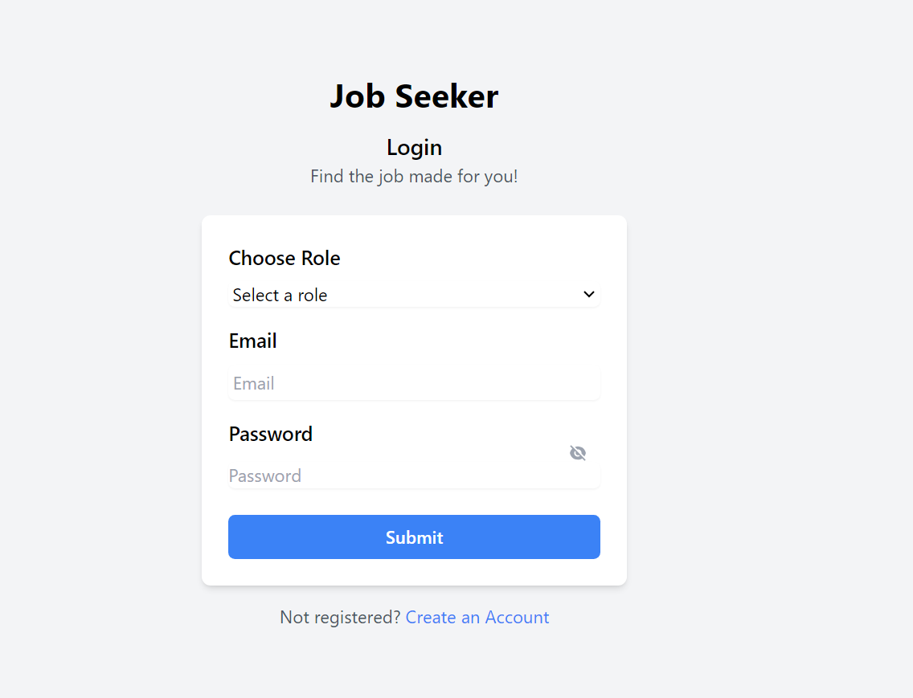

### Home Page:
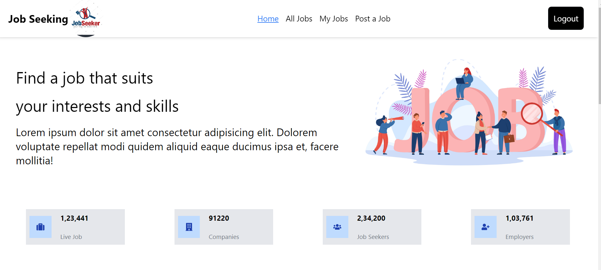

### List of all Jobs:
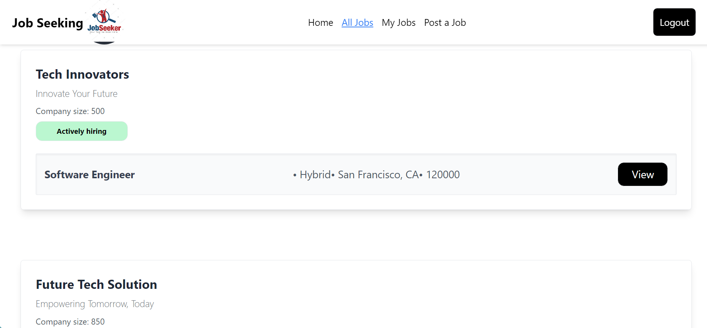

## Employee view:

### Particular job:
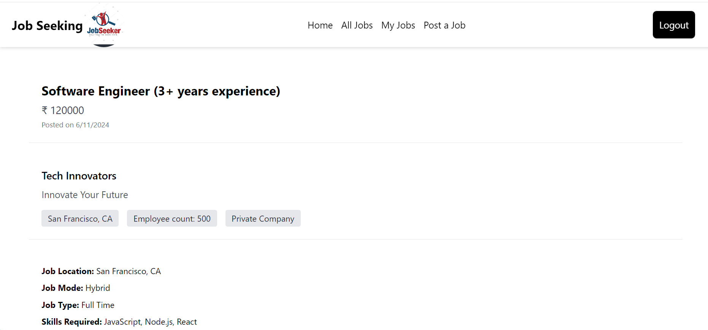

#### NOTE: the employee will not see the apply button

### My Jobs:
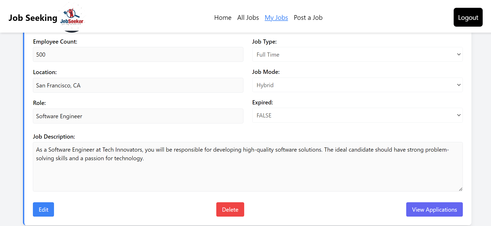

#### NOTE: the employee is allowed to either edit or delete a job and view the application

### View an Application:

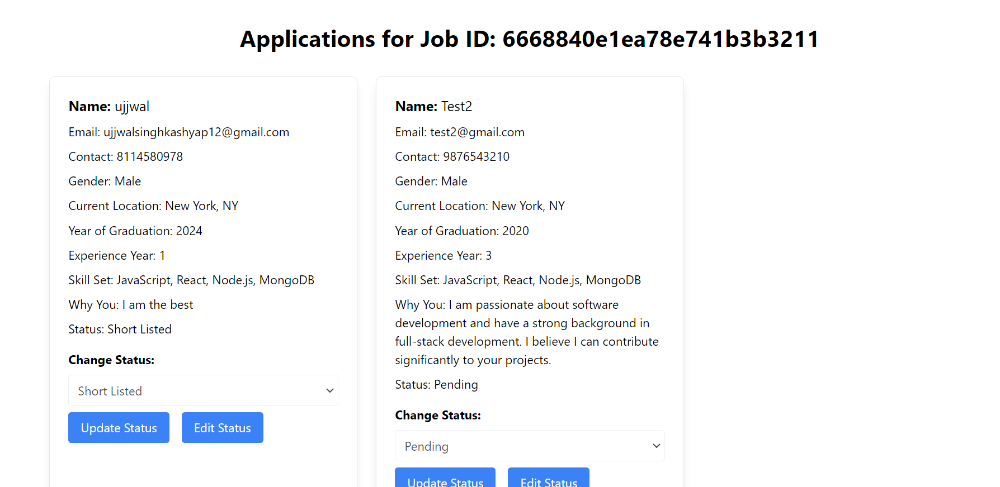

#### NOTE: The employee is allowed to change the application status by clicking on edit button ,if the status is set short listed the applicant will receive a mail from job seeker team.

### Post a job:
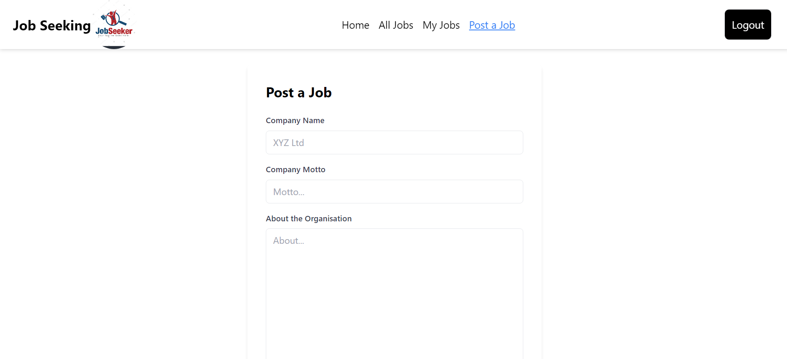

## Job Seeker View:

### Particular job if Already Applied:
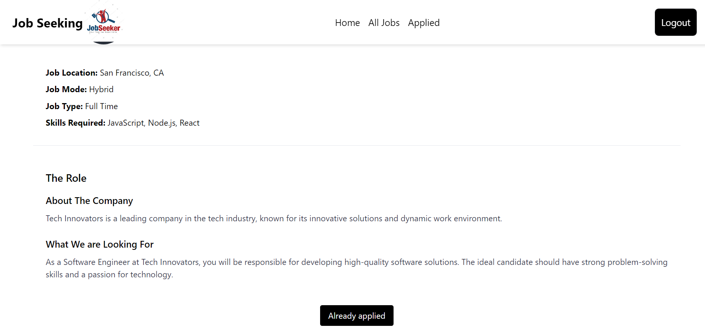

### Particular job if not Applied:
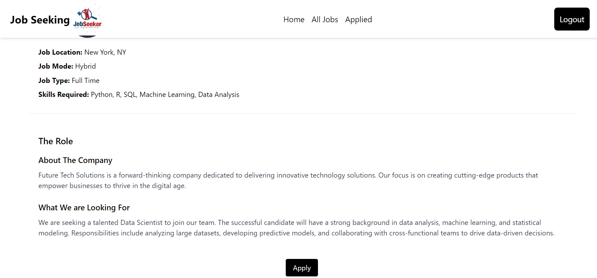

### Application Form:
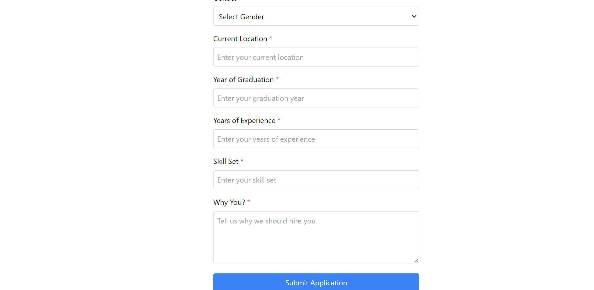

### Job application for already applied job:
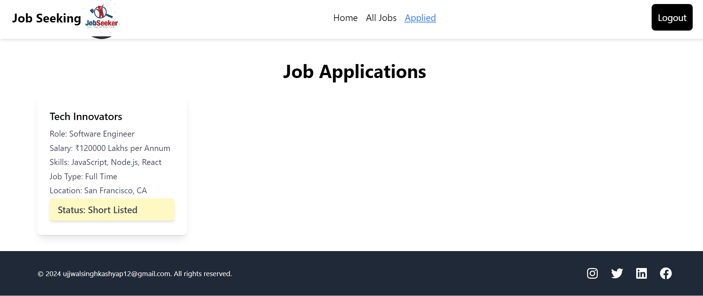

### mail receive from job seeker team on shortlisting:
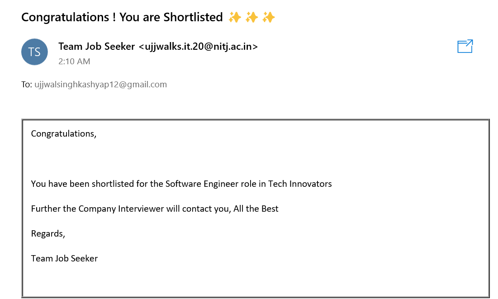

